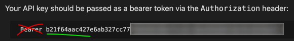

 

🇺🇸 [Read this in English](./README.en.md)

# Obsidian Film Saver

Расширение для Google Chrome, которое позволяет сохранять фильмы и сериалы с сайта **HDrezka** (rezka.ag) напрямую в вашу базу знаний **Obsidian** одним кликом.

## Возможности

- Автоматический сбор данных о фильме/сериале (название, год, жанры, страны, режиссеры, актеры, рейтинги IMDb и Кинопоиск).
- Красивое всплывающее окно для добавления вашей личной оценки.
- Скачивание постера (обложки) в нужном формате.
- Прямая бесшовная загрузка `.md` заметки и файла постера в ваш Vault по локальной сети.

## Как это работает?

Расширение использует плагин **Local REST API** для связи с Obsidian напрямую. Вы нажимаете кнопку на сайте -> расширение формирует заметку -> отправляет файлы прямо в Obsidian.

## Установка и настройка

### 1. Настройка Obsidian
1. Откройте Obsidian и зайдите в **Настройки** -> **Community plugins** (Сторонние плагины).
2. Выключите "Restricted mode" (Безопасный режим).
3. Нажмите кнопку **Browse** (Обзор) и найдите плагин `Local REST API`.
4. Установите и включите его.
5. Зайдите в настройки этого плагина (Local REST API) и:
   - **Включите настройку:** `Enable Non-Encrypted (HTTP) Server` (Включить незашифрованный сервер).
   - **Скопируйте `API Key`**, который там написан (копируйте **только сам ключ**, без слова `Bearer`).

     

### 2. Установка расширения

**Для Chrome / Edge / Яндекс Браузера:**
1. Скачайте код этого проекта.
2. В браузере перейдите по адресу: `chrome://extensions/`.
3. В правом верхнем углу включите тумблер **«Режим разработчика»** (Developer mode).
4. Нажмите кнопку **«Загрузить распакованное расширение»** (Load unpacked) и выберите папку с этим расширением.

**Для Firefox:**
1. Скачайте код этого проекта.
2. В браузере перейдите по адресу: `about:debugging#/runtime/this-firefox`
3. Нажмите кнопку **«Загрузить временное дополнение...»** (Load Temporary Add-on...).
4. Выберите файл `manifest.json` из папки с расширением.

### 3. Настройка расширения
1. Нажмите правой кнопкой мыши по иконке расширения на панели задач (или найдите его на странице расширений) и выберите **«Параметры»** (Options).
2. Вставьте скопированный из Obsidian **API Key**.
3. **ВАЖНО:** Убедитесь, что в поле "Адрес сервера" указано именно `http://127.0.0.1:27123` (с цифрой 3 на конце, так как это порт для HTTP сервера).
4. Нажмите "Сохранить".

Готово! Теперь зайдите на любую страницу фильма на HDrezka, обновите её, и нажмите кнопку «Сохранить в Obsidian».

## Структура папок в Obsidian
По умолчанию расширение сохраняет фильмы по пути:
- `Фильмы и Сериалы/Фильмы/Имя Фильма (Год).md`
- Постер сохраняется в `Фильмы и Сериалы/Фильмы/Постеры/...`

Базовую папку (`Фильмы и Сериалы`) можно легко поменять в настройках расширения.
